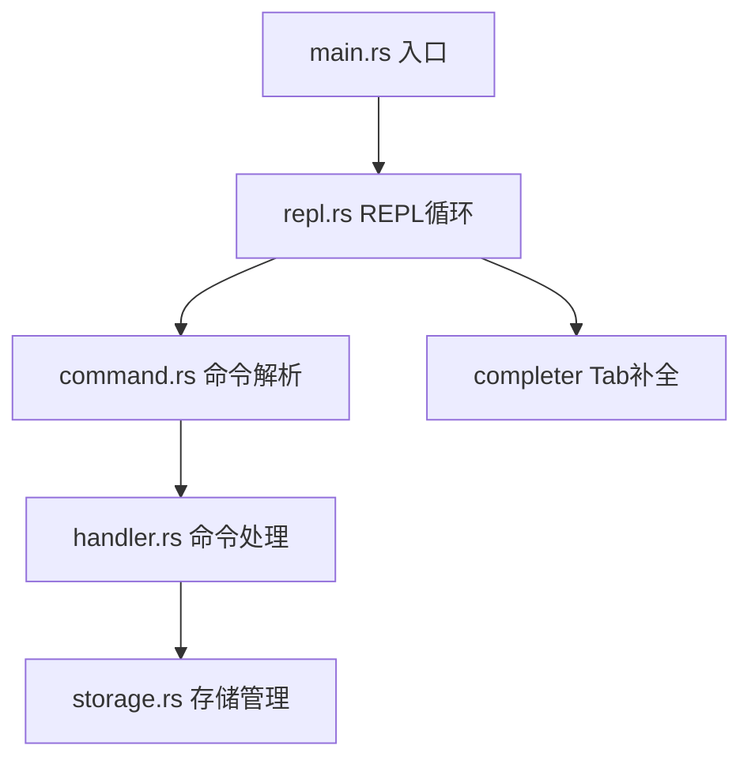

## 产品概述

一个基于 REPL 交互的 CLI 笔记本工具，用户运行 `idontnote` 进入交互式命令行，在其中执行各种笔记管理命令。

## 核心功能

- **REPL 交互**：运行 `idontnote` 进入 REPL 命令行，支持上下键历史和命令补全
- **mknote \<filename\>**：创建笔记文件，仅支持 `.md` 和 `.txt` 格式
- **initnote path \<path\>**：初始化笔记本，指定笔记存储的绝对/相对路径目录
- **listnote**：列出所有已存储的笔记
- **rmnote \<filename\>**：删除指定笔记
- **catnote \<filename\>**：在终端查看笔记内容
- **editnote \<filename\>**：使用系统编辑器打开笔记进行编辑
- **renote \<old\> \<new\>**：重命名笔记
- **searchnote \<keyword\>**：搜索笔记内容
- **help**：显示帮助信息
- **exit / quit**：退出 REPL

元数据通过笔记本目录下的 `notes.toml` 文件记录笔记元信息（创建时间、标签等）。当前阶段仅搭建命令行架子，不实现具体业务逻辑。

## 技术栈

- 语言：Rust (edition 2024)
- REPL 库：`rustyline`（支持历史记录、Tab 补全）
- 序列化：`serde`（derive feature）
- 元数据格式：`toml` + `serde`
- 错误处理：`thiserror`（自定义错误类型）

## 实现方案

采用模块化分层架构，将 REPL 循环、命令解析、命令处理、存储管理分离为独立模块。当前阶段所有命令处理函数仅输出占位信息（如 "mknote: 创建笔记 study.md"），不实现真实 I/O 逻辑。

关键设计决策：

- **命令解析**：定义 `Command` 枚举，在 REPL 循环中将用户输入字符串解析为枚举变体，未识别输入提示帮助信息
- **rustyline 补全**：实现 `Completer` trait，基于命令名列表提供 Tab 补全
- **存储管理**：`Storage` 结构体持有笔记本根路径，提供各命令所需的路径解析和元数据读写接口（暂为空实现）
- **二进制名称**：在 Cargo.toml 中设置 `[[bin]] name = "idontnote"`，确保编译产物名为 `idontnote`

## 实现备注

- `rustyline` 在 Windows 上需要使用其默认的后端，无需额外配置
- 元数据文件 `notes.toml` 的读写接口预留但暂不实现，避免引入不必要的复杂度
- 所有命令处理返回 `Result`，统一错误类型便于后续实现

## 架构设计



- **main.rs**：程序入口，初始化 Storage 并启动 REPL
- **repl.rs**：rustyline REPL 循环，读取输入、分发命令、输出结果
- **command.rs**：定义 Command 枚举及 parse 函数
- **handler.rs**：各命令的处理函数占位
- **storage.rs**：Storage 结构体，管理笔记本路径和元数据接口

## 目录结构

```
d:\System\Desktop\rust\idont-notebook\
├── Cargo.toml                    # [MODIFY] 添加依赖和二进制名称配置
├── src/
│   ├── main.rs                   # [MODIFY] 入口：初始化 Storage，启动 REPL
│   ├── repl.rs                   # [NEW] REPL 循环：rustyline 读取、命令分发、结果输出
│   ├── command.rs                # [NEW] Command 枚举定义、命令解析逻辑
│   ├── handler.rs                # [NEW] 各命令处理函数占位（mknote/initnote/listnote/rmnote/catnote/editnote/renote/searchnote/help）
│   └── storage.rs                # [NEW] Storage 结构体：笔记本路径管理、元数据接口预留
```

### 文件详细说明

- **Cargo.toml** [MODIFY]
- 添加 `[[bin]] name = "idontnote" path = "src/main.rs"` 使二进制名为 `idontnote`
- 添加依赖：`rustyline`、`serde`（derive）、`toml`、`thiserror`

- **main.rs** [MODIFY]
- 创建 `Storage` 实例，调用 `repl::run()` 启动 REPL 循环

- **repl.rs** [NEW]
- 实现 REPL 主循环，使用 rustyline 的 `Editor` 读取输入
- 将输入通过 `command::parse()` 解析为 `Command` 枚举
- 根据枚举变体调用 `handler` 中对应函数
- 实现 `IdontCompleter`，基于命令名列表提供 Tab 补全
- 处理 `exit`/`quit` 命令退出循环

- **command.rs** [NEW]
- 定义 `Command` 枚举：Mknote(String)、Initnote(String)、Listnote、Rmnote(String)、Catnote(String)、Editnote(String)、Renote(String, String)、Searchnote(String)、Help、Exit
- 实现 `parse(input: &str) -> Result<Command>` 函数，将输入字符串解析为枚举

- **handler.rs** [NEW]
- 为每个命令变体提供一个处理函数，接收 `&mut Storage` 引用
- 当前阶段仅打印占位信息，如 `"mknote: 创建笔记 study.md"`
- 所有函数返回 `Result<(), NotebookError>`

- **storage.rs** [NEW]
- 定义 `Storage` 结构体，持有 `notebook_path: Option<PathBuf>`
- 定义 `NotebookError` 枚举（使用 thiserror）
- 预留 `init()`、`get_note_path()`、`list_notes()` 等方法签名（暂为空实现）

## SubAgent

- **code-explorer**
- Purpose: 探索 Rust 生态中 rustyline 的典型用法和项目结构模式
- Expected outcome: 确认 rustyline API 使用方式和最佳实践